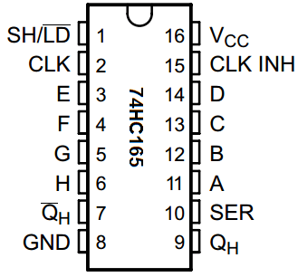

# 74HC165 Debugging Recipe

This guide provides a step-by-step approach to debugging the 74HC165 Parallel-In Serial-Out (PISO) shift register in your Wokwi project and on physical hardware.

## Phase 1: Verify Connections (The "sanity check")

Before writing code, ensure the wiring is logically sound.



### 1. Power & Ground
- [ ] **VCC** (Pin 16) -> 5V (use the red common rail on your breadboard).
- [ ] **GND** (Pin 8 of 74HC165) -> Arduino GND (or the common ground rail on your breadboard).
- [ ] **GND** (Pin 15, CE/Clock Inhibit) -> GND (Critical! If this is floating or high, the clock is ignored).
- [ ] **SER** (Pin 10, DS/Serial In) -> GND (Unless you are daisy-chaining multiple chips, tie this to ground so "0"s are shifted in from the "upstream").

### 1.1 The Pull-Up Resistors (Crucial!)
You asked: "The only connection to VCC is through the Arduino?" -> **Connect the Arduino 5V to the Breadboard's RED Rail.**
Now you have a "Power Strip" of 5V holes.
1.  Connect **Chip Pin 16** to the Red Rail.
2.  Connect **One end of the Resistor** to the Red Rail.
3.  Connect the **Other end of the Resistor** to the Input Pin (e.g., Pin 11).
4.  Connect your **Button** from the Input Pin (Pin 11) to the Blue Rail (GND).

**Visual:**
```
[Red Rail (5V)] <---- Resistor ----> [Input Pin on Chip] <---- Button ----> [Blue Rail (GND)]
```
*When button is NOT pressed, 5V flows through resistor to Input (HIGH).*
*When button IS pressed, Input connects to GND (LOW).*

### 2. Control Lines (SPI)
- [ ] **PL** (Pin 1, Parallel Load / Latch) -> Arduino Pin 10 (or any digital output). This must be **HIGH** normally, and pulsed **LOW** to capture button states.
- [ ] **CP** (Pin 2, Clock) -> Arduino Pin 13 (SCK).
- [ ] **Q7** (Pin 9, Data Out) -> Arduino Pin 12 (MISO).

### 3. Inputs (D0 - D7 / A - H)
*Note: Some datasheets/images use letters A-H instead of D0-D7.*
| Pin | Label (Letter) | Label (Bit) | Arduino Code |
| :--- | :--- | :--- | :--- |
| **11** | **A** | **D0** | Bit 0 (Button 1) |
| **12** | **B** | **D1** | Bit 1 |
| **13** | **C** | **D2** | Bit 2 |
| **14** | **D** | **D3** | Bit 3 |
| **3** | **E** | **D4** | Bit 4 |
| **4** | **F** | **D5** | Bit 5 |
| **5** | **G** | **D6** | Bit 6 (Button 2) |
| **6** | **H** | **D7** | Bit 7 (Button 3) |

- [ ] **Pull-up Resistors**: Unused inputs *must not float*. Wokwi simulation might be forgiving, but real hardware is not.
    -   Used inputs (Buttons): Connect button between Pin and GND. Connect 1k-50k Resistor between Pin and VCC (1k, 10k, 47k are all fine!).
    -   Unused inputs: Connect directly to GND (or VCC).

## Phase 2: The "Minimal Viable" Code Test

Use this logic to isolate the shift register from MIDI/USB complications.

### 1. SPI Configuration
The 74HC165 is simple. It samples on one edge and shifts on the other.
-   **Speed**: Start slow. `100000` (100kHz) is safe. `1000000` (1MHz) is standard.
-   **Bit Order**: `MSBFIRST`.
-   **Mode**: `SPI_MODE0` (CPOL=0, CPHA=0) or `SPI_MODE2` is usually correct.

### 2. The Loop Logic
1.  **Latch**:
    ```cpp
    digitalWrite(PIN_PL, LOW);
    delayMicroseconds(5); // Wait for data to settle
    digitalWrite(PIN_PL, HIGH);
    ```
2.  **Read**:
    ```cpp
    byte data = SPI.transfer(0);
    ```
3.  **Print Binary**:
    ```cpp
    Serial.print("Binary: ");
    Serial.println(data, BIN);
    ```

## Phase 3: Troubleshooting Symptoms

### Symptom: "I always read 0 (or 255)"
-   **Check CE (Clock Enable)**: Is it grounded?
-   **Check PL (Parallel Load)**: Is it stuck LOW? (It needs to be HIGH to shift).
-   **Check Wiring**: Are MISO/MOSI swapped? (Remember: 74HC165 Output -> Arduino Input (MISO)).

### Symptom: "The bits are shifting randomly"
-   **Check SER (Serial In)**: If it's floating, random noise enters as you shift bits. Tie it to GND.
-   **Check Clock Ground**: Ensure shared ground between Arduino and 74HC165.

### Symptom: "Inputs are always 1 (High) - Even when pressing button"
This means the **shift register is NOT seeing Ground (0V)** when you press the button.
**Possible Causes:**
1.  **Button not connected to Ground**: Check the wire from the button to the Blue Rail.
2.  **Blue Rail not connected to Arduino**: Check the wire from Blue Rail to Arduino GND.
3.  **Button inserted wrong**: Push buttons often have pins connected in pairs. Try rotating it 90 degrees.
4.  **Button wired to 5V**: Did you accidentally connect the button to the Red Rail instead of the Blue Rail? (If so, it pulls HIGH when idle, and HIGH when pressed -> Always HIGH).

**The "Paperclip Test" (Bypass the button):**
1.  Take a jumper wire connected to **GND (Blue Rail)**.
2.  Touch the other end directly to the **Input Pin on the Chip**.
3.  Does it turn to `0`?
    -   **YES**: Your button is broken or wired wrong.
    -   **NO**: Your Blue Rail is not connected to Ground (or the chip is bad).

## Phase 4: Wokwi Specifics
-   Ensure `diagram.json` has `rotate` set correctly if orientation is confusing.
-   Verify `attrs` in `diagram.json` correspond to physically connected pins if using custom parts.
