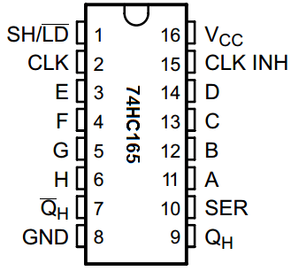
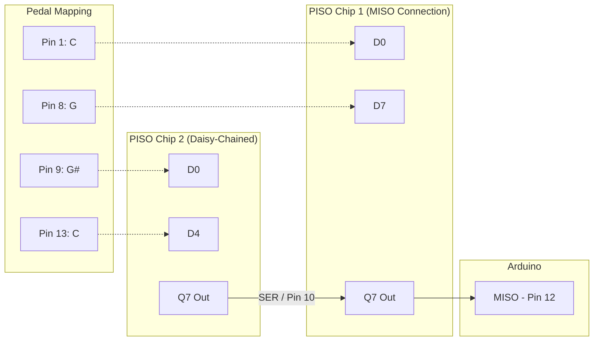
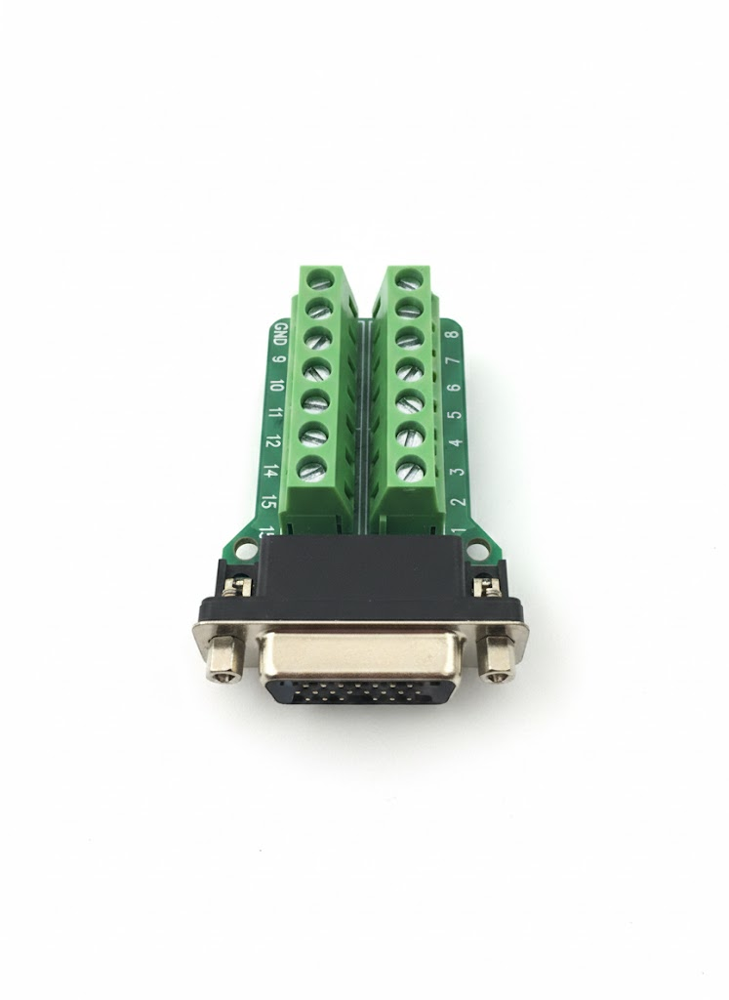

# Pedalboard Wiring Guide

This document tracks the physical mapping of the 13-note pedalboard (C2 to C3) to the 15-pin connector breakout board.

## 1. Connector Mapping

Based on the [handwritten scribble](file:///home/ori/.gemini/antigravity/brain/3698dc20-111b-4431-b2a5-b4d7b3d2c49/uploaded_media_0_1771746426115.jpg), the 13 pedals map to the terminals as follows:

| Note | Terminal Pin | Key Type |
| :--- | :--- | :--- |
| **C** | 1 | White |
| **C#** | 2 | Black |
| **D** | 3 | White |
| **D#** | 4 | Black |
| **E** | 5 | White |
| **F** | 6 | White |
| **F#** | 7 | Black |
| **G** | 8 | White |
| **G#** | 9 | Black |
| **A** | 10 | White |
| **A#** | 11 | Black |
| **B** | 12 | White |
| **C (High)** | 13 | White |
| **-** | 14 | *Available* |
| **-** | 15 | *Available* |

| Note | DB15 Pin | Shift Register | Input Index | **IC Pin** | MIDI Note |
| :--- | :--- | :--- | :--- | :--- | :--- |
| **C** | 1 | Chip 1 | D0 | **11** | 60 |
| **C#** | 2 | Chip 1 | D1 | **12** | 61 |
| **D** | 3 | Chip 1 | D2 | **13** | 62 |
| **D#** | 4 | Chip 1 | D3 | **14** | 63 |
| **E** | 5 | Chip 1 | D4 | **3** | 64 |
| **F** | 6 | Chip 1 | D5 | **4** | 65 |
| **F#** | 7 | Chip 1 | D6 | **5** | 66 |
| **G** | 8 | Chip 1 | D7 | **6** | 67 |
| **G#** | 9 | Chip 2 | D0 | **11** | 68 |
| **A** | 10 | Chip 2 | D1 | **12** | 69 |
| **A#** | 11 | Chip 2 | D2 | **13** | 70 |
| **B** | 12 | Chip 2 | D3 | **14** | 71 |
| **C (High)** | 13 | Chip 2 | D4 | **3** | 72 |

## 2. 74HC165 Pinout Reference

Use this diagram to find the physical pins on your 74HC165 chips.

## 2. Wiring Diagram & Physical Order

In a daisy chain, the data flows through the chips to the Arduino. To match the code logic:

*   **Chip 1**: The chip **directly connected to the Arduino** (MISO pin).
*   **Chip 2**: Connected to the **Serial Input (SER)** of Chip 1.

> [!IMPORTANT]
> **Chip 1** must be the one that talks to the Arduino directly. If you swap them, the notes will be shifted (Chip 2 will become the lower notes).

## 3. Hardware Progress

### Pedal Console Internal
The original analog connections have been replaced with a centralized 15-pin breakout to simplify the interface with the Arduino shift registers.

### DB15 Breakout Board
This 15-pin screw terminal board serves as the main junction point.

## 3. The Mapping Reference
The following scribble was used as the source for this digital mapping:

---
*Next Step: Connecting these 13 terminals to the 74HC165 shift register inputs in the same order.*
