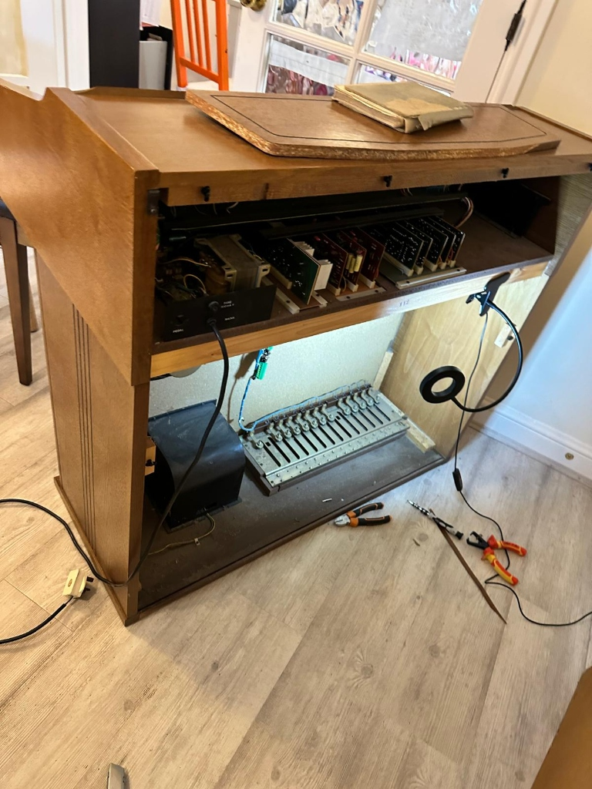
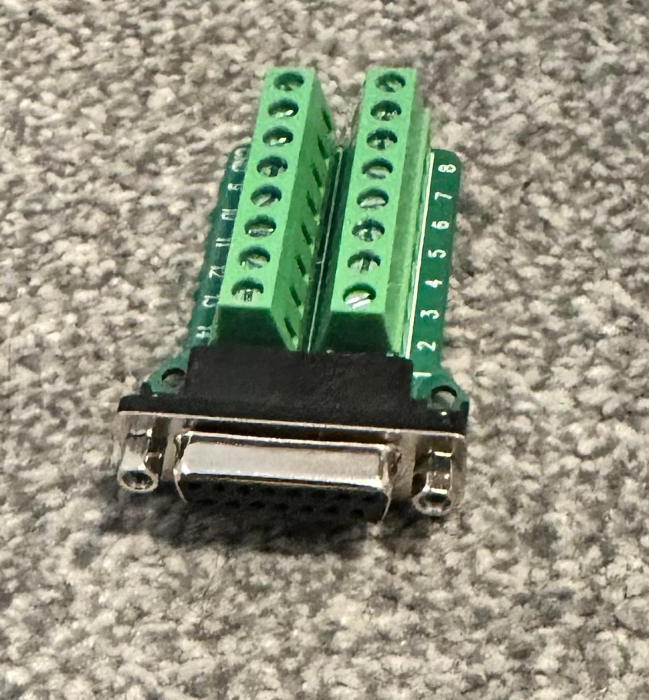
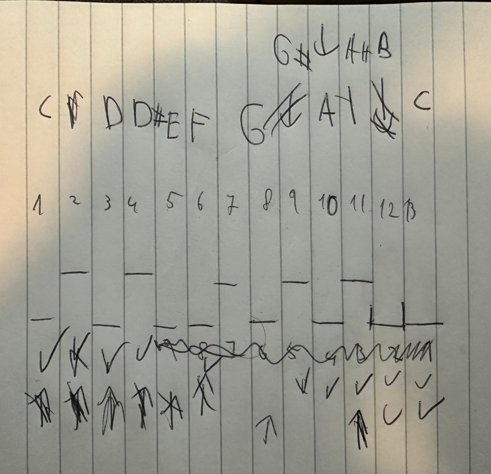

# Pedalboard Wiring Guide

This document tracks the physical mapping of the 13-note pedalboard (C2 to C3) to the 15-pin connector breakout board.

## 1. Connector Mapping

Based on the [handwritten scribble](file:///home/ori/.gemini/antigravity/brain/3698dc20-111b-4431-b2a5-b4d7b3d2c649/uploaded_media_0_1771746426115.jpg), the 13 pedals map to the terminals as follows:

| Note | Terminal Pin | Key Type |
| :--- | :--- | :--- |
| **C** | 1 | White |
| **C#** | 2 | Black |
| **D** | 3 | White |
| **D#** | 4 | Black |
| **E** | 5 | White |
| **F** | 6 | White |
| **F#** | 7 | Black |
| **G** | 8 | White |
| **G#** | 9 | Black |
| **A** | 10 | White |
| **A#** | 11 | Black |
| **B** | 12 | White |
| **C (High)** | 13 | White |
| **-** | 14 | *Available* |
| **-** | 15 | *Available* |

## 2. Hardware Progress

### Pedal Console Internal
The original analog connections have been replaced with a centralized 15-pin breakout to simplify the interface with the Arduino shift registers.

### DB15 Breakout Board
This 15-pin screw terminal board serves as the main junction point.

## 3. The Mapping Reference
The following scribble was used as the source for this digital mapping:

---
*Next Step: Connecting these 13 terminals to the 74HC165 shift register inputs in the same order.*
