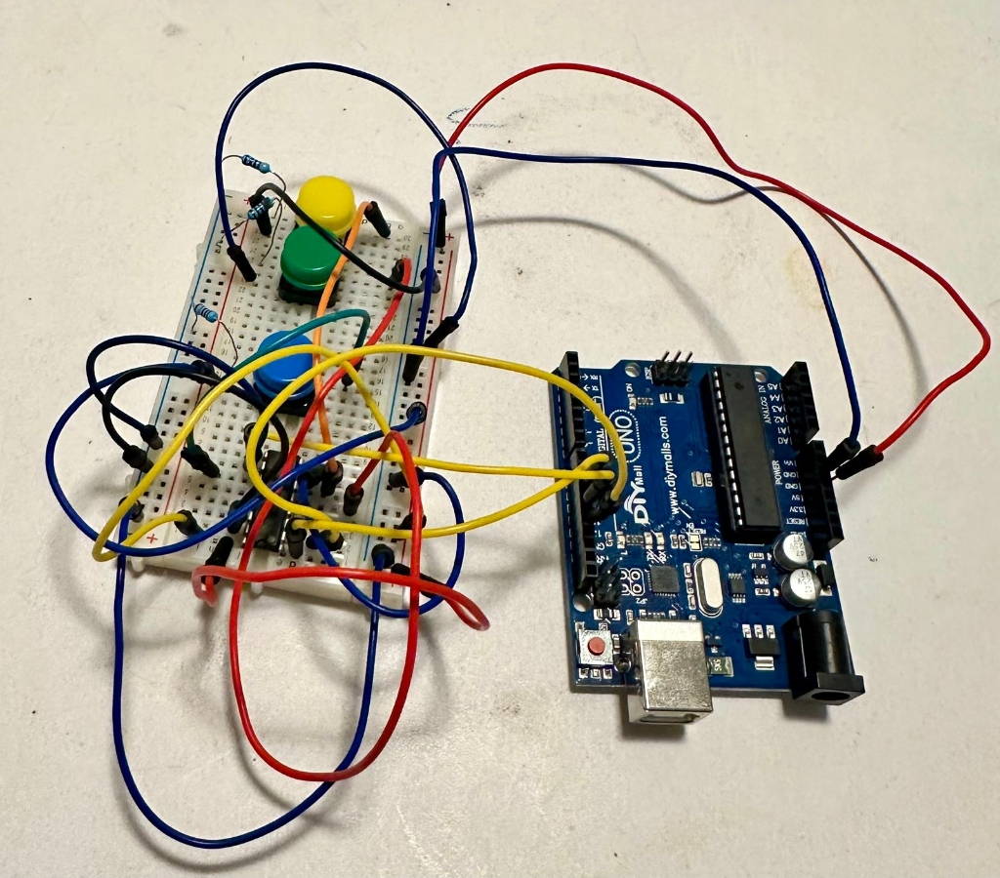
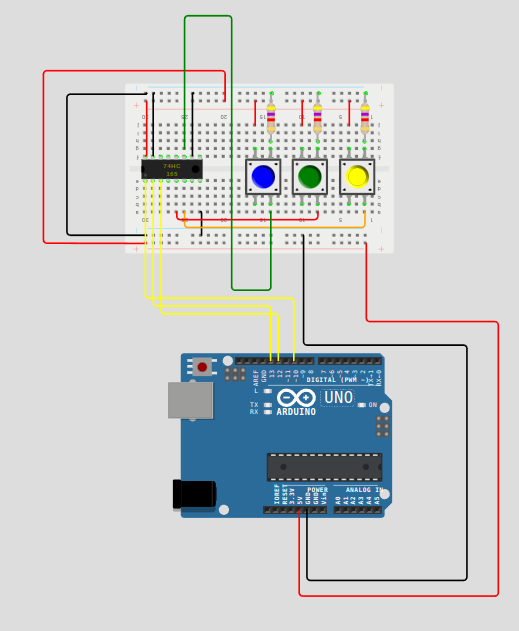

# Vintage Organ MIDI Retrofit

## Project Overview
This project aims to retrofit a vintage analog organ (2 Manuals + Pedals) into a MIDI controller using an Arduino-compatible microcontroller.

## Hardware Architecture
*   **Controller**: Arduino Mega 2560 or Teensy 4.1 (Simulation: Arduino Uno)
*   **Method**: Keyboard Matrix Scanning
*   **Outputs**: USB MIDI
*   **Display**: 20x4 LCD (I2C Address 0x27)

## MIDI Channels
*   **Upper Manual**: Channel 1
*   **Lower Manual**: Channel 2
*   **(Bass) Pedals**: Channel 3

## Project Structure
*   `src/Organ_Main.ino`: Main Arduino sketch.
*   `src/MatrixScanner.h/cpp`: Matrix scanning logic.
*   `src/config.h`: Pin definitions and configuration.
*   `diagram.json`: Wokwi simulation diagram.

## Development Environment
*   Target: Arduino IDE / PlatformIO
*   Libraries: `MIDI` (`USB-MIDI` on Teensy)

## Building for Wokwi Simulation

This project configured to use a local installation of `arduino-cli` (in `./bin`) to build the firmware for the Wokwi simulator.

To rebuild the project (e.g., after modifying `src/Organ_Main.ino`), run the following command in the terminal:

```bash
# Copy latest source to temp build folder and compile
cp src/Organ_Main.ino build_temp/Organ_Main/ && ./bin/arduino-cli compile --fqbn arduino:avr:uno build_temp/Organ_Main --output-dir build
```

This command:
1.  Updates the temporary build sketch folder with your latest code.
2.  Compiles it for the **Arduino Uno**.
3.  Outputs the binary to `build/Organ_Main.ino.hex`.

## Wokwi & Antigravity Configuration

To enable simulation within the Antigravity (Gravity) IDE, the following changes and tools were added:

*   **Local Build Tools**: Since the environment lacks system-wide Arduino tools, a local copy of `arduino-cli` was installed in the `./bin` directory.
*   **Wokwi Configuration**:
    *   `diagram.json`: Define the hardware (Arduino Uno, LEDs, etc.).
    *   `wokwi.toml`: Points Wokwi to the compiled firmware path (`build/Organ_Main.ino.hex`).
    *   `libraries.txt`: Lists libraries for Wokwi to download (e.g., `MIDI` for the organ project).
*   **Build Process**: A custom build command is used to move files to a temporary folder (`build_temp`) to satisfy Arduino CLI's folder naming requirements before compiling.

## Current Exercise: Simple LED Blink with Button

A basic circuit was implemented to verify the Wokwi environment and simulating inputs:

1.  **Circuit Diagram**:
    *   **Push Button** (`btn1`): Connected in series between Arduino Pin 13 and the LED.
    *   **Connections**: Pin 13 -> Button Pin 1 -> Button Pin 2 -> LED Anode -> LED Cathode -> Resistor -> GND.
2.  **Code Behavior**: 
    *   The sketch (`src/Organ_Main.ino`) blinks Pin 13 (ON for 1s, OFF for 4s).
3.  **Result**: 

## PISO Shift Register (74HC165) Implementation

The project now uses a **74HC165** Parallel-In Serial-Out shift register to read the inputs (DIP Switches).

### SPI Logic
To achieve high-speed reading, the simulation uses the standard **SPI library**:
*   **Protocol**: SPI Mode 0, 1MHz Clock, MSB First.
*   **Connections**:
    *   **LATCH** (PL) -> Pin 10
    *   **CLOCK** (CP) -> Pin 13 (SCK)
    *   **DATA** (Q7) -> Pin 12 (MISO)
*   **Logic Type**: **Active High** (Input Pin -> Ground via pulldown, or Switch to VCC). 
    *   *Note*: The current implementation reads `1` when a button is pressed and `0` when released.
*   **Bit Mapping**:
    *   Button 0 -> Bit 0
    *   Button 1 -> Bit 6
    *   Button 2 -> Bit 7

## MIDI Integration

The simulation outputs standard MIDI data via the Serial port.
*   **Mapping**: Switches D0-D7 -> MIDI Notes 60-67 (C4-G4).
*   **Velocity**: Fixed at 127.
*   **Protocol**: Standard Serial MIDI (31250 baud) via `MIDI.h`.

## LCD Status Display (I2C)

The system includes a 20x4 LCD display to provide real-time feedback on the organ's status.
*   **Library**: `LiquidCrystal_I2C`
*   **Connection**:
    *   **SDA** -> Arduino A4
    *   **SCL** -> Arduino A5
*   **I2C Address**: `0x27`

### Display Layout
*   **Row 0**: Static "Organ System" title.
*   **Rows 1-3**: Real-time ON/OFF status for buttons 0, 6, and 7.
    *   `0 - ON` / `0 - OFF`
    *   `6 - ON` / `6 - OFF`
    *   `7 - ON` / `7 - OFF`

### Connecting Simulation to Host MIDI (Yoshimi/DAW)

The easiest way to connect the simulation to your computer's MIDI system is using the included **Python Bridge**.

1.  **Expose Serial Port**: 
    The `wokwi.toml` is configured to forward serial data to localhost:4000.
    ```toml
    rfc2217 = { port = 4000 }
    ```

2.  **Install Python Dependencies**:
    You need `mido` and `python-rtmidi` to create virtual MIDI ports.
    ```bash
    pip install mido python-rtmidi
    ```

3.  **Run the Bridge**:
    When the Wokwi simulation is running, execute:
    ```bash
    python3 midi_bridge.py
    ```
    This will create a MIDI input named **"Wokwi Bridge"**.

4.  **Connect**: 
    Open Yoshimi (or any synth), go to Settings -> MIDI, and select **"Wokwi Bridge"** as the input.


### Prerequisites: Installing Yoshimi (Synthesizer)
You need a software synthesizer to make sound.
```bash
sudo apt install yoshimi
```

### Option 2: Mock Simulation (Python Only)
If you cannot connect Wokwi to MIDI, use the mock script to verify your Linux MIDI setup.

**How it works:**
The `mock_organ.py` script uses the `mido` library to talk to the Linux sound system (ALSA).
1.  **Virtual Port**: It asks the OS to create a new "software cable" (Virtual MIDI Port) named "Organ Mock".
2.  **Message Generation**: Inside a loop, it constructs digital MIDI packets (e.g., `Note On, Key 60, Velocity 127`).
3.  **Transmission**: It pushes these packets into the software cable.
4.  **Reception**: When you connect Yoshimi to "Organ Mock", Yoshimi listens to the other end of that cable and plays the audio samples.

1.  Run the mock script:
    ```bash
    python3 mock_organ.py
    ```
2.  Connect Yoshimi to the **"Organ Mock"** MIDI input.
3.  You should hear a C Major scale.

## Examples
See the [examples/](examples/) directory for isolated test sketches.
*   [Rhythm Simulation (rhythm_sim.ino)](examples/README.md): Plays a MIDI pattern to verify the audio pipeline.

## Software & MIDI Setup (Choir Mode)
The system is configured to play a high-quality choir sound by default.

- **Soundfont Source**: [Florestan_Ahh_Choir.sf2](https://github.com/mrbid/SoundFonts) (Note: Currently leveraging the built-in `FluidR3_GM.sf2` high-quality General MIDI choir).
- **Patch**: Program 52 (Choir Aahs).
- **Automation**: The `simple_midi_bridge.py` automatically switches to the choir sound upon the first note press to ensure the MIDI command is registered by FluidSynth.

## Hardware & Wiring Docs
- **Pedalboard Mapping**: [PEDAL_WIRING.md](PEDAL_WIRING.md) (15-pin connector logic).
- **Debugging Recipe**: [74hc165_debugging_recipe.md](74hc165_debugging_recipe.md).
- **Pitfalls Log**: [ELECTRONICS_PITFALLS.md](ELECTRONICS_PITFALLS.md).

## Phase One: Initial Prototype
Early verification of the 74HC165 logic using a breadboard and 3 test buttons.




## Phase Two: System Expansion (Daisy-Chaining)
Current phase: Expanding the system to handle the full 13-note pedalboard using two daisy-chained 74HC165 registers.

### Hardware Gallery
The vintage console has been prepared with a centralized 15-pin breakout system to interface with the new digital electronics.

**Console Internals:**


**DB15 Breakout Board:**


---
*This documentation is part of an ongoing project to build a custom MIDI organ controller.*

